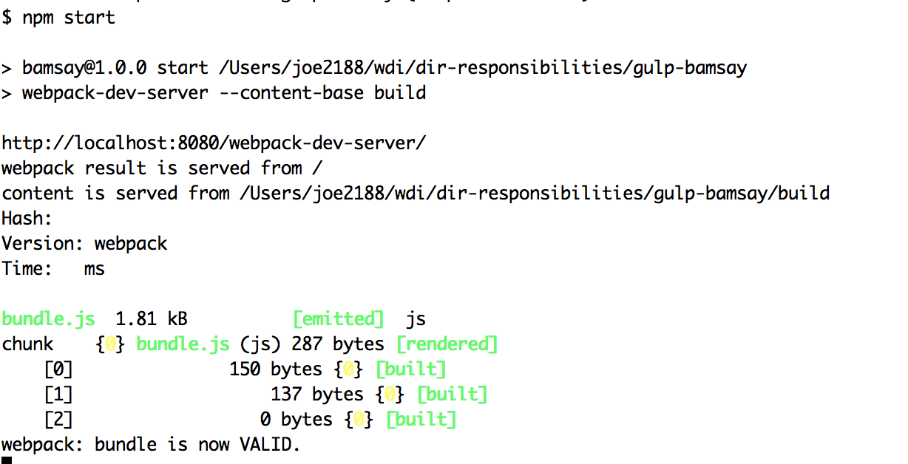

# Build Tools

## Learning Objectives

* Define build tools
* Introduce available build tools
* Use build tools to automate workflow

## Framing (5 min)

<details>
<summary>
Q. What is minified code and why do we do it use it?</summary>
<br>

```
Code in which all unnecessary characters have been removed from source code without changing its functionality at all.
```
<br>
<br>
</details>


<details>
<summary>
Q. When have you seen minified code before?</summary>
<br>

```
CDN files
```
<br>
<br>
</details>


<details>
<summary>
Q. What is complied code and what is used for?</summary>
<br>

```
Taking things like SASS, CoffeeScript, HAML, etc and converting it into css/html/javascript so our browser knows how to read it!
```
<br>
<br>
</details>

---------
In summary, build tools help us to compile our code so we don't have to do it manually and repeatedly.

## Gulp (5 min)


Gulp is an popular open-source automation tool built on Node.js that runs tasks to manipulate files on your system.

It is commonly used for bundling, minificiation, ES6 support, etc..

It's really similar to `rake` in Ruby!

[Gulp Documentation](http://gulpjs.com/)

## You-Do: Gulp Linter Example (15 min)

Fork and Clone this Repo: https://github.com/ga-wdi-exercises/gulp-bamsay

[Solution Code](https://github.com/ga-wdi-exercises/gulp-bamsay/tree/jshint-solution)

### Installation

```bash
$ npm install gulp -g
```

>install globally

```bash
$ npm install gulp --save-dev
```
>install as dependency in project


```bash
$ touch `gulpfile.js`
```
>This needs to be installed in your root directory and will contain all of your related task configuration

```bash
$ gulp

```
```bash

[10:36:31] Using gulpfile ~/wdi8/lessons/build-tools/gulp-example/gulpfile.js
[10:36:32] Task 'default' is not in your gulpfile
[10:36:32] Please check the documentation for proper gulpfile formatting


```
>Uh oh! - we ran into a problem! We need to define a `gulp task`

### Gulp Tasks

<details>
<summary>
Q. What is a task?</summary>
<br>

```

In Gulp, we create tasks that can transform our code.
A task may perform one job, or it can perform many at once.

```
<br>
<br>
</details>

----------

In our `gulpfile.js` we need to include the gulp module. To do this, we should define a variable: `var gulp = require('gulp');` This will allow us to call upon Gulp to create a task.

### My First (Default) Task

By default, Gulp requires a default task. It is the first task that Gulp will look for when reading your `gulpfile.js`.

Let's define our first (default) task below in our `gulpfile.js`:

```js
var gulp = require('gulp');

//define a task with the name of 'default'
// and a callback to perform when the task is ran
gulp.task('default', function() {
  console.log('I am the default task!');
});

```
In your terminal, run `$ gulp`.

>This will have the library look for a default task in your `gulpfile.js`. It will then execute the callback that you define for your task.

You should see something like the following:

```bash
[10:37:37] Using gulpfile ~/wdi8/lessons/build-tools/gulp-example/gulpfile.js
[10:37:37] Starting 'default'...
I am the default task!
[10:37:37] Finished 'default' after 104 μs
```

<details>
<summary>
Q. Does the string `'default'` matter what we call it?
</summary>
<br>

```
Yes, and no. While you can certainly change `default` to `pizza`, it would not be very descriptive of the task.

Also, whatever you define 'name' as in your task: gulp.task('name', callbackFunction)

You need to run the following in our command line:

$ gulp <name>

```
<br>
<br>
</details>


## STOP

## Review (5 min)

Let's Review and Answer questions!

## Plugins (5 min)

[Gulp plugins](http://gulpjs.com/plugins/)

Gulp has many additional plugins that we can use in our applications. We need to install them each individually using `npm install <dependency-name> --save-dev`

>Note we writing `--save-dev` instead of `--save`.
>This adds a separate  `"devDependencies"` object in which we will be saving our dependences. Don't worry too much about the difference for now, just know these plugins would be used differently in production!

## You-Do: Jshint Plugin Example (15 min)

We are going to be working with the `jshint` and `jshint-stylish` plugins so we can easily identify any javascript errors in our code!

```bash
$ npm install jshint gulp-jshint --save-dev
$ npm install --save-dev jshint-stylish
```

In our `gulpfile.js`, let's add the following modules for `jshint`:

```js
var gulp   = require('gulp');
var jshint = require('gulp-jshint');
var stylish = require('jshint-stylish');
```
>Nothing new here, just requiring our dependencies we will be using

Now, let's add our task!

```js
gulp.task('jshint', function() {
  return gulp.src('./js/*.js')
  .pipe(jshint())
  .pipe(jshint.reporter(stylish));
});
```
<details>
<summary>
Q. What is `gulp.src`?
</summary>
<br>

```

gulp.src is specifying our file source paths. It can also take an array of source paths.


```
<br>
<br>
</details>


<details>
<summary>
Q. What do you think `'./js/*.js'` represents ?
</summary>
<br>

```
Linting all of of javascript files in our `js` directory

```
<br>
<br>
</details>


<details>
<summary>
Q. What is `.pipe()` in gulp?
</summary>
<br>

```
.pipe() is used to pipe the source file(s) into a plugin. These pipes can chain tasks together so you can add as many plugins as you need!

```
<br>
<br>
</details>
--------------

Now, run the following in your command line:

``` bash
$ gulp jshint

```
## Bonus

## STOP

## Review

Let's Review and Answer questions!

## We-do: Gulp SASS (25 min)

### Gulp-Sass

Let's use Gulp to compile our `sass`!

We are going to be using the following `gulp-sass` plugin.

[Gulp-Sass](https://www.npmjs.com/package/gulp-sass).

Feel free to continue along on the same `gulpfile.js`. However, always feel free to checkout to `linter-solution` as well for working code.

First, let's install and save our plugin:

```bash
$ npm install gulp-sass --save-dev

```

Next, let's require the `gulp-sass` dependency:

```js
var gulp = require('gulp');
var sass = require("gulp-sass");
```

And then let's add a new task:

```js
gulp.task('sass', function () {
 return gulp.src('./css/**/*.scss')
   .pipe(sass().on('error', sass.logError))
   .pipe(gulp.dest('./css/'))
});
```

<details>
<summary>
Q. What do we see here in this task thats different?
</summary>
<br>

```
1. sass.logError, which will display an error

2. gulp.dest()

* `gulp.dest` will copies our results to a given directory. In this case to our `css` directory.

```
<br>
<br>
</details>

```bash
$ gulp sass

```

Great, it worked? But how is that helpful when compiling sass?

### Gulp Watch & Connect

We are going to add these two dependencies as well! Our goal is for us to see any reflected sass changes without manually server reloading or browser refreshing.

Finally, we will be integrating all the tasks to help automate our workflow.

[Gulp Watch](https://www.npmjs.com/package/gulp-watch)

[Gulp Connect](https://www.npmjs.com/package/gulp-connect)


```bash
$  npm install --save-dev gulp-watch

$ npm install --save-dev gulp-connect

```

```js

var gulp = require('gulp');
var sass = require("gulp-sass");
var watch = require('gulp-watch');
var connect = require('gulp-connect');
```

```js
gulp.task('watch', function () {
 gulp.watch('./css/**/*.scss', ['sass']);
});

```

```js
gulp.task('connect', function() {
  connect.server({
    livereload: true
  })
});

```
<details>
<summary>
Q. What `gulp.watch()` doing ?
</summary>
<br>

```
watching our sass file for changes
```
<br>
<br>
</details>


<details>
<summary>
Q. What is `connect.server({livereload: true})` doing?
</summary>
<br>

```
Reloading without manually writing a command in terminal
```
<br>
<br>
</details>

------

Let's now add `.pipe(connect.reload())` to our `sass` task:

```
gulp.task('sass', function () {
 return gulp.src('./css/**/*.scss')
   .pipe(sass().on('error', sass.logError))
   .pipe(gulp.dest('./css/'))
   .pipe(connect.reload());
});

```
Finally, let's add the following at the bottom of our `gulpfile.js`:

```
gulp.task('default', ['sass', 'connect', 'watch']);

```

```bash
$ gulp

```

<details>
<summary>
Q. Why do we not need to specify our task in the above command?
</summary>
<br>

```
Because we used `default`, gulp will automatically execute the `default` command
```
<br>
<br>
</details>


```
[13:25:59] Using gulpfile ~/wdi8/sandbox/bamsay/gulpfile.js
[13:25:59] Starting 'sass'...
[13:25:59] Starting 'connect'...
[13:25:59] Finished 'connect' after 18 ms
[13:25:59] Starting 'watch'...
[13:25:59] Finished 'watch' after 15 ms
[13:25:59] Server started http://localhost:8080
[13:25:59] LiveReload started on port 35729
[13:25:59] Finished 'sass' after 72 ms
[13:25:59] Starting 'default'...
[13:25:59] Finished 'default' after 3.63 μs

```


## Webpack

[Webpack Documentation](https://webpack.github.io/)

webpack is known as a "code bundler". It is used to bundle JavaScript files to run in our browsers, and can be used for transforming, bundling, or packaging assets and resources.

In essence, it takes your code, transforms and bundles it, then returns a brand new version of your code.

We will be using Webpack with React!

While Gulp is known as a "task runner", webpack does a little more. Task runners will compile your code as shown in the previous section. Webpack similarly can compile code, but takes things a step further by *bundling* modules and files together. What does that mean exactly?

In short, it allows for faster development.  Task runners like Gulp and Grunt need to rebuild the entire application every time you save.  Bundlers like webpack only rebuild the modules you have specifically edited!

### You-do: Setup

`git checkout webpack_starter`

run: `npm install webpack --save-dev`

Try testing it out by running `webpack` in the terminal

You should see something like:

```bash
webpack 1.12.12
Usage: https://webpack.github.io/docs/cli.html

Options:
  --help, -h, -?
  --config
  --context
  --entry
...
  --display-cached-assets
  --display-reasons, --verbose, -v

Output filename not configured.
```

<details>
<summary>
What does this tell us?
</summary>
<br>

```
We haven't configured what we actually want to do with webpack yet!
```
<br>
<br>
</details>

## STOP

### You Do: Configuring the Webpack

To actually configure our webpack, we need to create a new file in the root of our directory: `webpack.config.js`

Here we will need to define the folders and files that we want bundled, as well as any additional functionality from our tool. We are going to add in a few pieces of code:

```js
var path = require('path');

var PATHS = {
  js: path.join(__dirname, 'js'),
  build: path.join(__dirname, 'build')
};
```

<details>
<summary>
What do you think this first part is doing?
</summary>
<br>

```
This simply defines two folders within our app that we will be either reading or modifying with webpack.

*Note* 'path' is a node method
```
<br>
<br>
</details>

```js
module.exports = {
  // Entry accepts a path or an object of entries. We'll be using the
  // latter form given it's convenient with more complex configurations.
  entry: {
    js: PATHS.js
  }
```

<details>
<summary>
What do you think this next section does?
</summary>
<br>

```
Here we are defining the entry point of our webpack. In other words, whatdirectory do we want to look into and bundle?
```
<br>
<br>
</details>

Lastly, we will need to define the output. Where are we going to put thebundled code?

```js
,
  output: {
    path: PATHS.build,
    filename: 'bundle.js'
  }
};
```  

**Try running `webpack` in your terminal again. What happens?**

Check out your public folder and see what file was added in!

## STOP

### Setting up Webpack Server

Having to run `webpack` every time you make a change will get frustrating (and boring) quickly. We can set up the `webpack-dev-server` to help us out!

One of the best features of the dev server is [Hot Module Replacement](https://webpack.github.io/docs/hot-module-replacement.html) (HMR). This is a feature provided by webpack that will update specific modules live. In other words, we can potentially update specific parts of our app without having the refresh the entire page!

To get started, run the following in you command line:

`npm i webpack-dev-server --save-dev`

We can now add this directly to our `package.json` file, allowing us the ability to start up our application immediately on the webpack dev server. Include the following in your `scripts` object in the `package.json` file:

`"start": "webpack-dev-server --content-base build"`

Go ahead and run `npm start` in your terminal. You should see something like:



If you open your browser to `localhost:8080`, you should see your index.html and any html rendered through your index.js file on the browser!

This is cool and all, but not really any different than before other than running a different command in your terminal. We want to be able to make changes to our code and see the updates without having to do any additional refreshing.

We will have to install another package to get this up and running: `npm i webpack-merge --save-dev`

This package allows us to merge objects together. In this case, we will be merging the object that sets our paths, with HMR.

In webpack.config.js, include the following on line 2:

```js
var merge = require('webpack-merge');
var webpack = require('webpack');
var TARGET = process.env.npm_lifecycle_event;
```

We will then replace everything from `module.exports` and down with the following:

```js
var common = {

  // Entry accepts a path or an object of entries. We'll be using the
  // latter form given it's convenient with more complex configurations.
  entry: {
    app: PATHS.js
  },
  output: {
    path: PATHS.build,
    filename: 'bundle.js'
  }
};

// Default configuration
if(TARGET === 'start' || !TARGET) {
  module.exports = merge(common, {});
}

if(TARGET === 'build') {
  module.exports = merge(common, {});
}
```

<details>
<summary>
What is this doing??
</summary>
<br>

```
Depending on the command we run (start, or build) we will be merging the 'common' object with whatever we include in the empty objects
```
<br>
<br>
</details>

Now all we are missing is adding in the HMR. Let's edit the first `if` statement to include this:

```js
if(TARGET === 'start' || !TARGET) {
  module.exports = merge(common, {
    devServer: {
      contentBase: PATHS.build,
      // Enable history API fallback so HTML5 History API based
      // routing works. This is a good default that will come
      // in handy in more complicated setups.
      historyApiFallback: true,
      hot: true,
      inline: true,
      progress: true,
      // Display only errors to reduce the amount of output.
      stats: 'errors-only',
      // Parse host and port from env so this is easy to customize.
      // If you use Vagrant or Cloud9, set
      // host: process.env.HOST || '0.0.0.0';
      // 0.0.0.0 is available to all network devices unlike default
      // localhost
      host: process.env.HOST,
      port: process.env.PORT
    },
    plugins: [
      new webpack.HotModuleReplacementPlugin()
    ]
  });
}
```

And remove ` --content-base build` from your `package.json`

**COOL**. Everytime we make a change to the js file and save the browser is automatically updated!

## You Do: Add in CSS watch!

We already have the setup done, so adding in CSS watch is simple!

We'll need another package for this:

`npm i css-loader style-loader --save-dev`

We then need to add the use of this package in as a module within our `common` variable after `output`:

```js
,
module: {
  loaders: [
    {
      // Test expects a RegExp! Note the slashes!
      test: /\.css$/,
      loaders: ['style', 'css'],
      // Include accepts either a path or an array of paths.
      include: PATHS.css
    }
  ]
}
```

If you run it now, an error about "Promise" will pop up. This is an ES6 bug that can be fixed with [this](https://github.com/stefanpenner/es6-promise#nodejs):

`npm install es6-promise`

`var Promise = require('es6-promise').Promise;`

Something still seems off.. Notice the `include:`.  That is pointing to a `PATHS.css`, but we haven't created that yet! Let's go ahead and add that in.  Inside your PATHS object, add `css: path.join(__dirname, 'css')`. Then, within your `common.entry` include `css: PATHS.css`

Go to your `style.css` and change the background to green, what happens?? Notice how the page does *not* refresh!

### Bonus: Figure out SASS configuration


## Closing (5 min)

### Additional Resources

[Webpack as middleware](https://webpack.github.io/docs/webpack-dev-middleware.html)

[Webpack compared](http://survivejs.com/webpack/webpack-compared/)

Additional Build Tools to Research:

[Gulp Tutorial](https://scotch.io/tutorials/automate-your-tasks-easily-with-gulp-js)

[Grunt Tutorial](http://www.brianchu.com/blog/2013/07/11/grunt-by-example-a-tutorial-for-javascripts-task-runner/)
